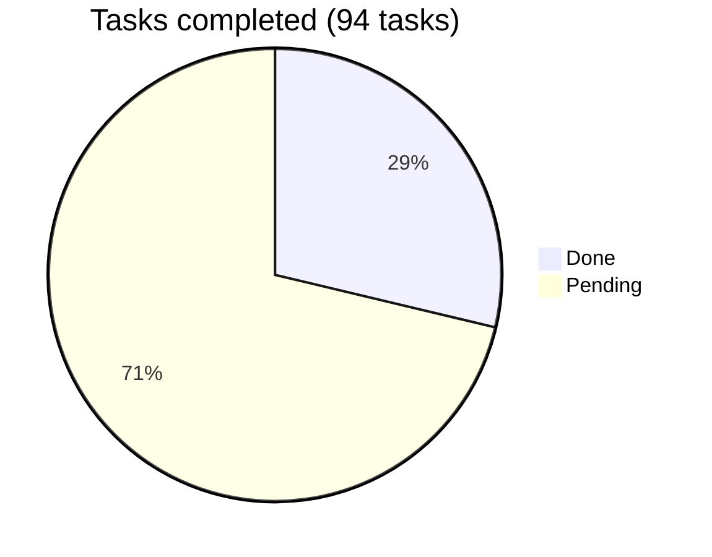

# Araguaney App — Roadmap

Phased plan for the mobile client. Same working method as the backend
repository: each phase is a file with objectives, non-objectives, tasks with
complexity, and a suggested order; totals live here. Phases build on each
other — the offline queue (06) deliberately comes after the online write path
(05) so that going offline changes *when* a capture is submitted, never *what*
it contains.

## Overall progress

| Phase | Name | Done | Pending | Progress |
|-------|------|-----:|--------:|----------|
| 0 | [Repository bootstrap and application scaffold](phase-00-bootstrap.md) | 10 | 0 | ✅ 100% |
| 1 | [API contract and generated client](phase-01-api-contract-client.md) | 8 | 0 | ✅ 100% |
| 2 | [Authentication and session](phase-02-auth-session.md) | 9 | 0 | ✅ 100% |
| 3 | [Local cache and read operations](phase-03-local-cache-read.md) | 0 | 9 | ⬜ 0% |
| 4 | [QR scanning](phase-04-qr-scanning.md) | 0 | 6 | ⬜ 0% |
| 5 | [Online intake and box operations](phase-05-intake-online.md) | 0 | 10 | ⬜ 0% |
| 6 | [Offline capture queue](phase-06-offline-queue.md) | 0 | 10 | ⬜ 0% |
| 7 | [Push notifications](phase-07-push-notifications.md) | 0 | 9 | ⬜ 0% |
| 8 | [Android release and distribution](phase-08-android-release.md) | 0 | 9 | ⬜ 0% |
| 9 | [iOS enablement](phase-09-ios-enablement.md) | 0 | 6 | ⬜ 0% |
| 10 | [Operational parity backlog](phase-10-operational-parity.md) | 0 | 8 | ⬜ 0% |
| **Total** | | **27** | **67** | **🟡 29%** |

## Dependencies worth naming

- **01 → everything networked.** No feature talks to the backend except through
  the generated client and its typed failures.
- **02 → 03, 05, 06, 07.** Session identity gates data scoping, writes, the
  per-user queue, and token registration.
- **05 → 06.** The offline queue reuses the online capture flow unchanged; it
  is a submission strategy, not a second form.
- **07 and 09 have external gates**: the backend push phase (backend
  repository's roadmap) and the Apple Developer Program, respectively.
- **08 task 1 (Google Play account) is external** and can proceed in parallel
  with any phase.

## First release target

The first internal-testing release worth handing to a real center is
**Phases 01–06 + 08**: login, consult offline, scan, capture online and
offline, distributed through Play internal testing. Push (07), iOS (09), and
parity blocks (10) follow.
