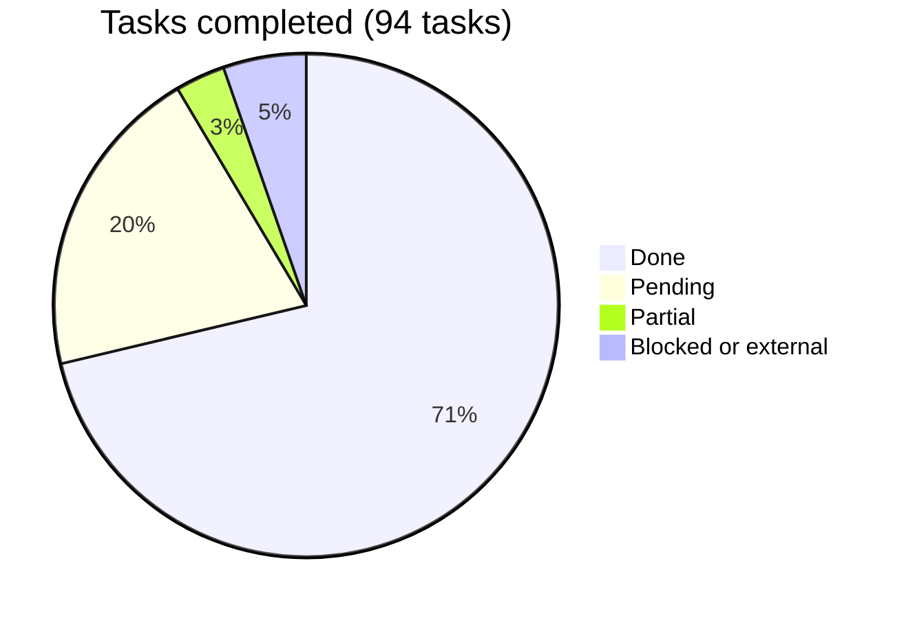

# Araguaney App — Roadmap

Phased plan for the mobile client. Same working method as the backend
repository: each phase is a file with objectives, non-objectives, tasks with
complexity, and a suggested order; totals live here. Phases build on each
other — the offline queue (06) deliberately comes after the online write path
(05) so that going offline changes *when* a capture is submitted, never *what*
it contains.

## Overall progress

| Phase | Name | Done | Pending | Progress |
|-------|------|-----:|--------:|----------|
| 0 | [Repository bootstrap and application scaffold](phase-00-bootstrap.md) | 10 | 0 | ✅ 100% |
| 1 | [API contract and generated client](phase-01-api-contract-client.md) | 8 | 0 | ✅ 100% |
| 2 | [Authentication and session](phase-02-auth-session.md) | 9 | 0 | ✅ 100% |
| 3 | [Local cache and read operations](phase-03-local-cache-read.md) | 8 | 1 | 🟨 89% (1 blocked) |
| 4 | [QR scanning](phase-04-qr-scanning.md) | 6 | 0 | ✅ 100% |
| 5 | [Online intake and box operations](phase-05-intake-online.md) | 10 | 0 | ✅ 100% |
| 6 | [Offline capture queue](phase-06-offline-queue.md) | 10 | 0 | ✅ 100% |
| 7 | [Push notifications](phase-07-push-notifications.md) | 2 | 7 | 🟨 22% (1 partial, 1 external) |
| 8 | [Android release and distribution](phase-08-android-release.md) | 4 | 5 | 🟨 44% (2 partial, 3 external) |
| 9 | [iOS enablement](phase-09-ios-enablement.md) | 0 | 6 | ⬜ 0% |
| 10 | [Operational parity backlog](phase-10-operational-parity.md) | 0 | 8 | ⬜ 0% |
| **Total** | | **67** | **27** | **🟢 71%** |

## Blocked work

- **Phase 07, task 1** needs the Android application registered in the Firebase
  project that already exists. Without it there is no `google-services.json` and
  the client cannot obtain a token, so nothing downstream can be proven end to
  end. The backend is waiting on exactly that first real token.

- **Phase 08, tasks 1, 5 and 8** need a Google Play developer account, the app
  created in its console, and listing assets. No code unblocks them. The upload
  keystore (task 2) and the Sentry DSN (task 7) are key material that does not
  belong in a repository; both are documented and the build reads them from
  outside.
- **Phase 03, task 5 (center stock screen)** needs a session-scoped backend
  endpoint returning stock by category for the caller's center. The `/v1`
  contract only aggregates stock nationally, and computing it on the device
  would require the client to decide which box statuses count as stock — a rule
  that belongs to the backend.

## Dependencies worth naming

- **01 → everything networked.** No feature talks to the backend except through
  the generated client and its typed failures.
- **02 → 03, 05, 06, 07.** Session identity gates data scoping, writes, the
  per-user queue, and token registration.
- **05 → 06.** The offline queue reuses the online capture flow unchanged; it
  is a submission strategy, not a second form.
- **07's backend gate is lifted.** The device endpoints are live and dispatch is
  on in production; what gates the phase now is registering the Android
  application in the existing Firebase project, which only produces a
  `google-services.json`. **09 still waits on the Apple Developer Program.**
- **08 task 1 (Google Play account) is external** and can proceed in parallel
  with any phase.

## First release target

The first internal-testing release worth handing to a real center is
**Phases 01–06 + 08**: login, consult offline, scan, capture online and
offline, distributed through Play internal testing. Push (07), iOS (09), and
parity blocks (10) follow.

Phases 01–06 are done, and Phase 08's code half with them. What stands between
the current state and that release is the material only a person can provide: a
Play account and an upload keystore.
