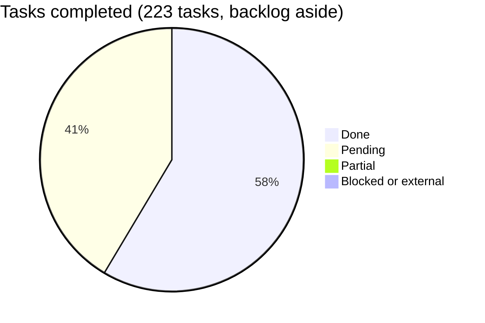

# Araguaney App — Roadmap

Phased plan for the mobile client. Same working method as the backend
repository: each phase is a file with objectives, non-objectives, tasks with
complexity, and a suggested order; totals live here. Phases build on each
other — the offline queue (06) deliberately comes after the online write path
(05) so that going offline changes *when* a capture is submitted, never *what*
it contains.

## Overall progress

Counted from the task tables of each phase file, which are the source of truth.
A row is done, partial, blocked/external, or pending; the totals below are the
sum of those rows and nothing else.

**Phase 10 is excluded from the total.** It is a backlog of candidate blocks,
not a task list: its own header says that a block gets split into its own phase
when it is scheduled. Counting it alongside the phases it graduates into
double-counts the same work — shipments are one row there and six tasks in
Phase 15 — and makes the board read as permanently unfinished. It keeps its
row below so the surface stays visible.

**The total fell from 88 % to 57 % on 2026-08-24, and nothing was undone.**
What changed is the denominator. Until that day the board measured this
application against its own list of phases, and that list had never been
compared to what the panel offers. [Parity with the
panel](parity-with-the-panel.md) is that comparison, derived rather than
remembered, and Phases 17 to 30 are what it found. A percentage is only as
honest as the list it divides by, and the old one was flattering because it was
short.

**Phase 11 reads as complete and is, against its own table.** That table listed
seven screens and left out every screen somebody sees before signing in, so the
phase closed without them ever being scheduled. Phase 16 is that omission,
written down and being paid off. A percentage is only as honest as the list it
divides by.

| Phase | Name | Done | Pending | Progress |
|-------|------|-----:|--------:|----------|
| 0 | [Repository bootstrap and application scaffold](phase-00-bootstrap.md) | 10 | 0 | ✅ 100% |
| 1 | [API contract and generated client](phase-01-api-contract-client.md) | 8 | 0 | ✅ 100% |
| 2 | [Authentication and session](phase-02-auth-session.md) | 9 | 0 | ✅ 100% |
| 3 | [Local cache and read operations](phase-03-local-cache-read.md) | 9 | 0 | ✅ 100% |
| 4 | [QR scanning](phase-04-qr-scanning.md) | 6 | 0 | ✅ 100% |
| 5 | [Online intake and box operations](phase-05-intake-online.md) | 10 | 0 | ✅ 100% |
| 6 | [Offline capture queue](phase-06-offline-queue.md) | 10 | 0 | ✅ 100% |
| 7 | [Push notifications](phase-07-push-notifications.md) | 10 | 1 | 🟨 91% (1 partial) |
| 8 | [Android release and distribution](phase-08-android-release.md) | 9 | 0 | ✅ 100% |
| 9 | [iOS enablement](phase-09-ios-enablement.md) | 0 | 6 | ⬜ 0% |
| 10 | [Operational parity backlog](phase-10-operational-parity.md) *(backlog, not counted)* | 5 | 9 | 🟨 36% (5 partial, 1 blocked) |
| 11 | [Design system](phase-11-design-system.md) | 14 | 0 | ✅ 100% |
| 12 | [Measuring a pallet with the camera](phase-12-pallet-height.md) | 0 | 6 | ⬜ 0% |
| 13 | [Finding a product by its barcode](phase-13-product-barcode.md) | 4 | 1 | 🟨 80% |
| 14 | [The account: profile, password and second factor](phase-14-account-and-security.md) | 5 | 1 | 🟨 83% |
| 15 | [The shipment, from opening to dispatch](phase-15-shipment-workflow.md) | 5 | 1 | 🟨 83% |
| 16 | [The screens phase 11 never reached](phase-16-session-screens.md) | 11 | 1 | 🟨 92% |
| 17 | [The product catalogue](phase-17-product-catalogue.md) | 0 | 8 | ⬜ 0% |
| 18 | [Pre-registered donations](phase-18-preregistered-donations.md) | 0 | 8 | ⬜ 0% |
| 19 | [Reports for the centre](phase-19-center-reports.md) | 0 | 8 | ⬜ 0% |
| 20 | [Campaigns](phase-20-campaigns.md) | 0 | 5 | ⬜ 0% |
| 21 | [Centres](phase-21-centers.md) | 0 | 5 | ⬜ 0% |
| 22 | [The centre application queue](phase-22-center-applications.md) | 0 | 6 | ⬜ 0% |
| 23 | [Incidents and the audit log](phase-23-incidents-and-audit.md) | 0 | 6 | ⬜ 0% |
| 24 | [Users beyond one centre](phase-24-users-beyond-a-center.md) | 0 | 6 | ⬜ 0% |
| 25 | [The studio](phase-25-the-studio.md) | 1 | 2 | 🟨 33% |
| 26 | [The shipment, from dispatch to delivery](phase-26-shipment-to-delivery.md) | 0 | 6 | ⬜ 0% |
| 27 | [Creating a transfer](phase-27-create-a-transfer.md) | 0 | 5 | ⬜ 0% |
| 28 | [The requests board](phase-28-the-requests-board.md) | 1 | 3 | 🟨 25% |
| 29 | [The minimum version gate](phase-29-the-version-gate.md) | 7 | 2 | 🟨 78% |
| 30 | [Writing as a national administrator](phase-30-writing-as-national-admin.md) | 1 | 6 | 🟨 14% |
| **Total** (Phase 10 aside) | | **130** | **93** | **🟢 58%** |

## What is missing, and how that is kept honest

[`parity-with-the-panel.md`](parity-with-the-panel.md) compares the panel's
navigation, its routes and the vendored contract against what this application
calls, and carries the command that regenerates the number. On 2026-08-24: 161
generated operations, 69 used, 92 unused.

Phases 17 to 30 come from that file. Several of them graduate blocks out of
Phase 10, which is what that backlog says should happen to a block when it is
scheduled.

## Blocked work

What this application needs from the backend is collected in
[`docs/backend-requests.md`](../backend-requests.md), with what each request
unblocks and what the application does instead meanwhile. The entries below are
the ones that block roadmap tasks.

- **Phase 08, tasks 1, 5 and 8** need a Google Play developer account, the app
  created in its console, and listing assets. No code unblocks them. The upload
  keystore (task 2) and the Sentry DSN (task 7) are key material that does not
  belong in a repository; both are documented and the build reads them from
  outside.
- **Phase 03 is complete.** Its last task was recorded as blocked on a missing
  endpoint; the endpoint existed. The screen ships as «Capturado por categoría»,
  which is what the number means. Reading it as stock needs request 1.
- **Phase 10, block 8 (Riverpod 3.x)** is blocked on the package ecosystem, not
  on this repository: `riverpod >=3.0.0-dev` cannot resolve alongside
  `drift_dev` and stable Flutter's `flutter_test` pins. Verified against the
  solver, not assumed.

## Dependencies worth naming

- **01 → everything networked.** No feature talks to the backend except through
  the generated client and its typed failures.
- **02 → 03, 05, 06, 07.** Session identity gates data scoping, writes, the
  per-user queue, and token registration.
- **05 → 06.** The offline queue reuses the online capture flow unchanged; it
  is a submission strategy, not a second form.
- **07 is unblocked and all but done.** The endpoints are live, the application
  is registered in Firebase, and everything from the token to the tap is wired.
  What remains is the `foss` packaging, which is a release concern.
  **09 still waits on the Apple Developer Program.**
- **08 task 1 (Google Play account) is external** and can proceed in parallel
  with any phase.

## First release target

The first internal-testing release worth handing to a real center is
**Phases 01–06 + 08**: login, consult offline, scan, capture online and
offline, distributed through Play internal testing. Push (07), iOS (09), and
parity blocks (10) follow.

Phases 01–06 are done, and Phase 08's code half with them. What stands between
the current state and that release is the material only a person can provide: a
Play account and an upload keystore.
